# Smart Study Buddy

Smart Study Buddy is a web-based study support system developed as part of an MSc Computing & Information Systems final year project at the University of Greenwich. The system transforms static academic materials into interactive study tools to improve learning efficiency and engagement.

## Problem
Students often study from static resources such as PDFs and scanned notes, which do not effectively support active learning, revision, or knowledge retention.

## Solution
The system processes uploaded academic content and automatically generates interactive learning resources including quizzes, flashcards, summaries, concept maps, and a study planner with gamified progress tracking.

## Key Features
- PDF and image-based document processing
- Automatic quiz and flashcard generation
- Rule-based content summarisation
- Concept map visualisation
- Study planner with PDF export
- Gamification using XP and levels
- Secure user authentication and progress tracking

## Tech Stack
- Frontend: HTML, CSS, JavaScript
- Backend: Node.js
- Database: MongoDB
- Authentication: Firebase
- Tools: PDF.js, Tesseract.js (OCR), D3.js

## Methodology
The project was developed using an Agile methodology with iterative sprints, enabling continuous feature refinement, testing, and integration throughout the development lifecycle.

## Algorithms
- **Content Extraction:** Text extraction from PDFs and OCR for image-based documents
- **Regex-Based Search:** Pattern matching used to clean, structure, and identify key academic content
- **Quiz Generation:** Rule-based question and distractor creation
- **Flashcards:** Automatic term-definition extraction
- **Gamification Logic:** XP-based progress and level unlocking

All algorithms are deterministic and rule-based to ensure transparency and explainability.

## Academic Context
This project represents an academic prototype demonstrating full-stack web development and rule-based intelligent systems.

## Author
**Haritha Kalaikovan**
MSc Computing & Information Systems, University of Greenwich.

## How to Run
1. Clone the repository:
   ```
   git clone https://github.com/24-hk/smart-study-buddy.git
   ```
2. Open the `SMART STUDY BUDDY` folder.
3. Open `index.html` in your browser (or run it through a local server such as the VS Code "Live Server" extension for full functionality).
4. Set up your own Firebase project credentials and MongoDB connection details where required by the app's configuration, as these are not included in this repository for security reasons.

## Screenshots

### Login Page


### Sign In Page
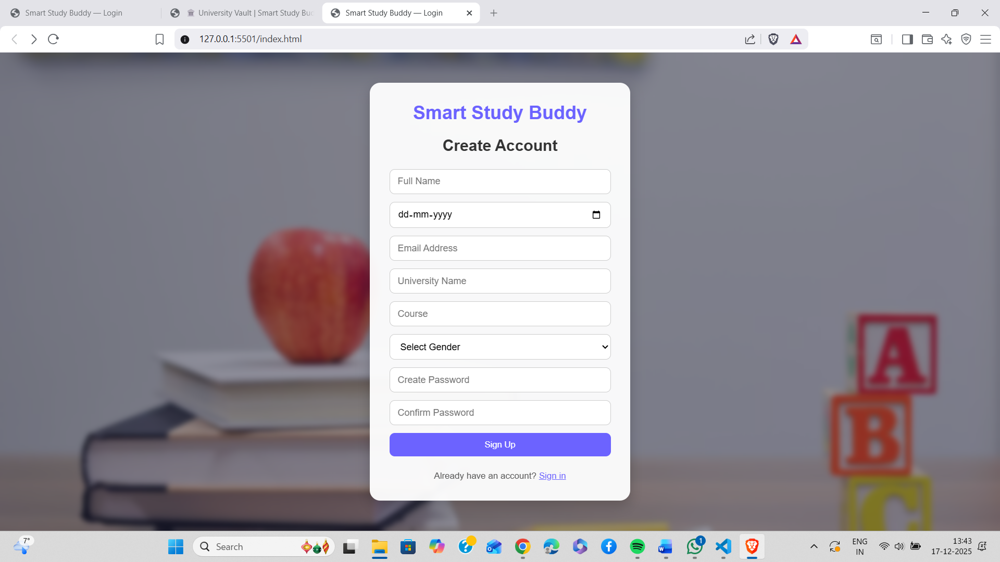

### Dashboard
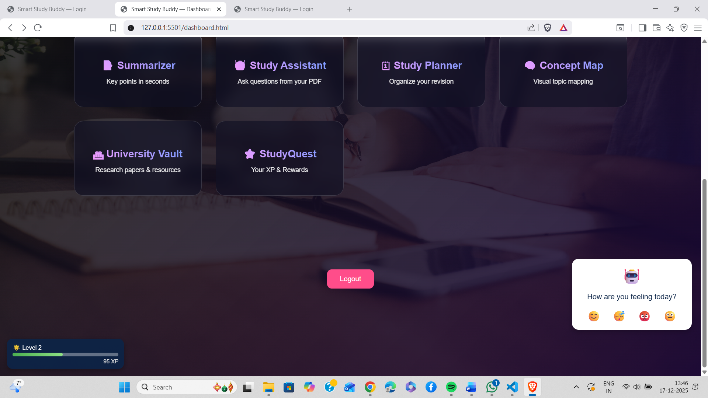
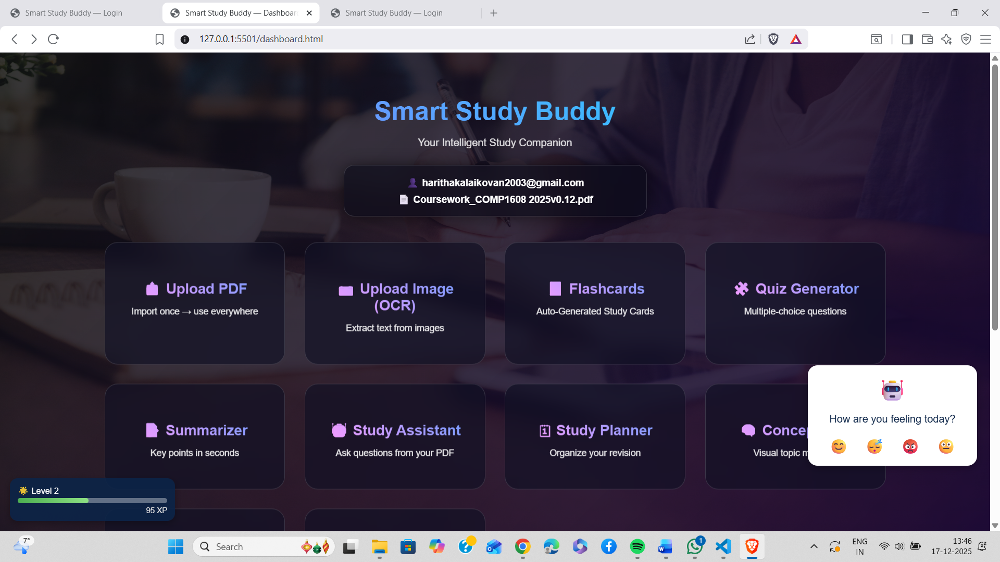

### PDF Upload


### Image Upload
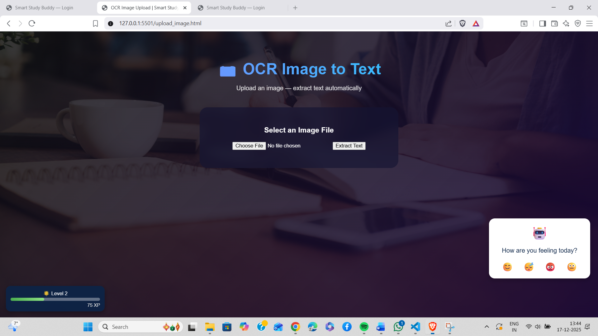

### Flashcards
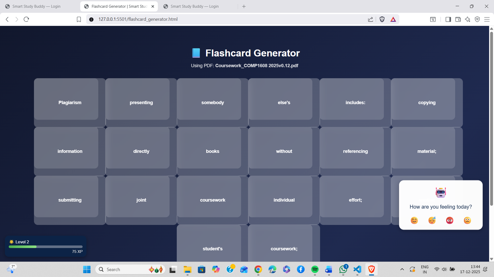

### Quiz Generator
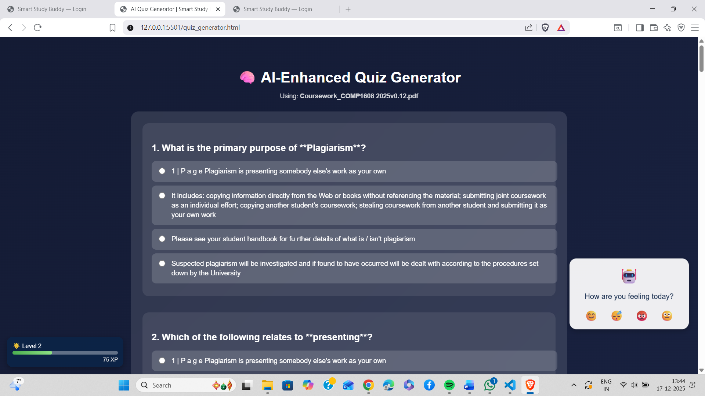

### PDF Summarizer
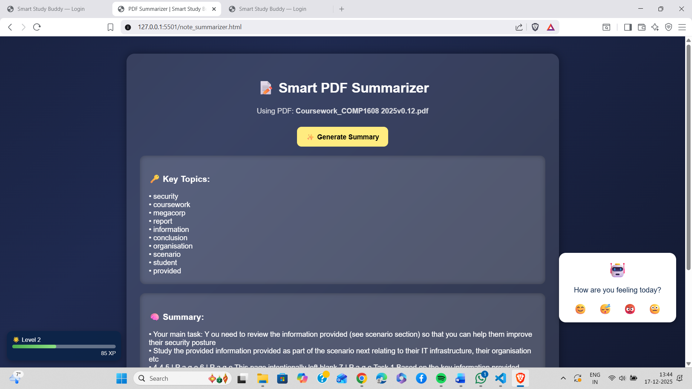

### Study Assistant
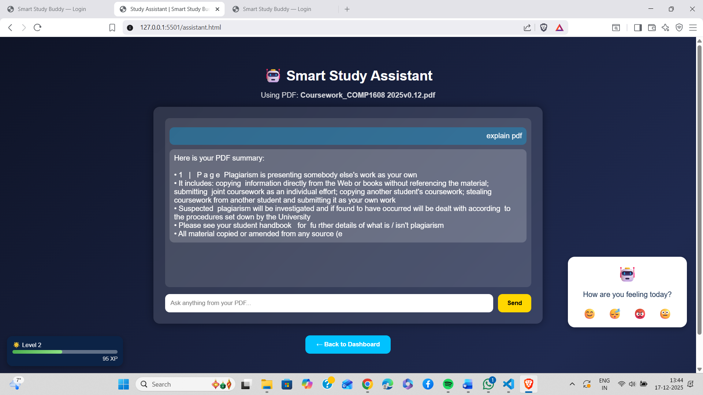

### Concept Map
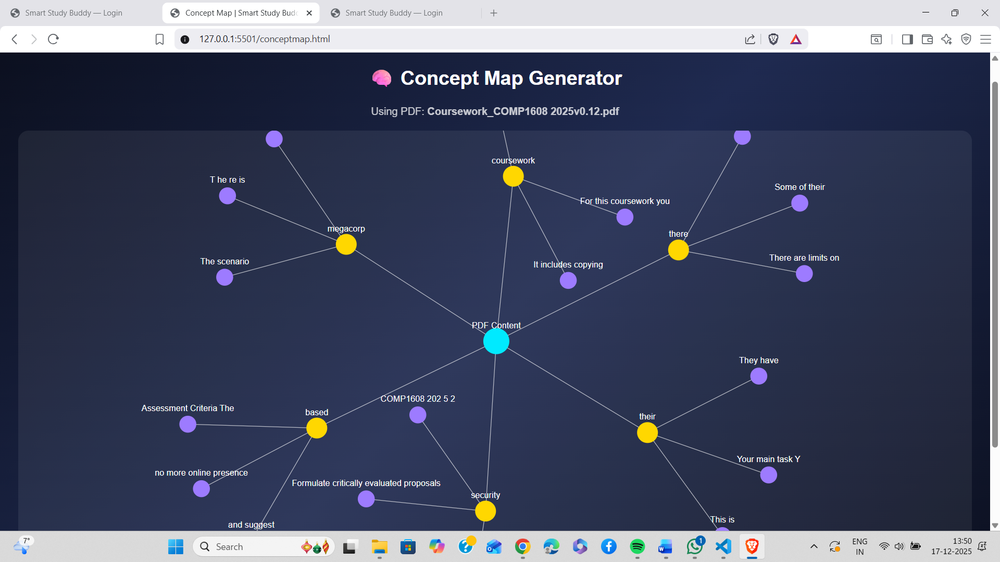

### Research Paper Tools


### Gamification
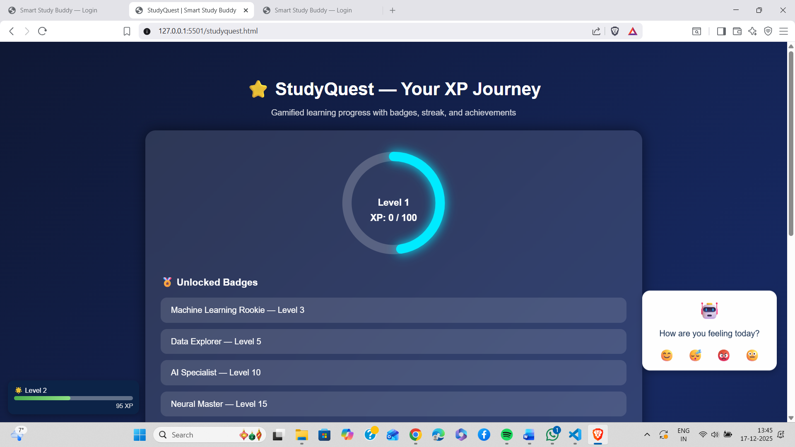
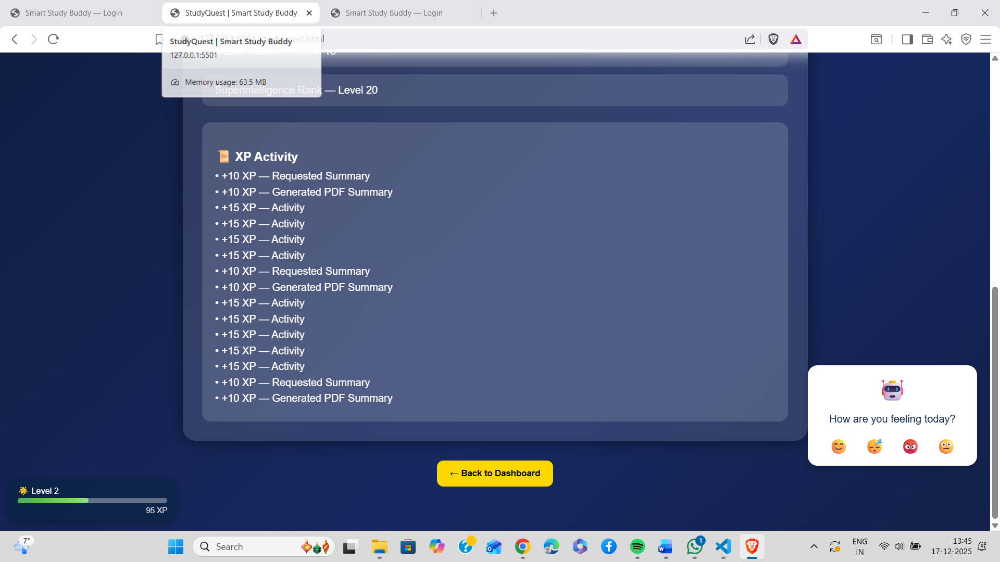
